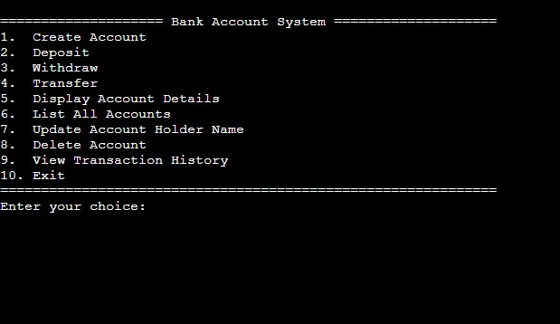

# 💳 Bank Account Management System

  <strong>A secure, file-based banking system built in C</strong>

  Advanced account management • Safe file handling • Transaction logging • GitHub-ready console architecture

  <a href="https://pixellinx.co.tz/">Pixellinx</a> •
  <a href="#features">Features</a> •
  <a href="#screenshots">Preview</a> •
  <a href="#getting-started">Getting Started</a>

---

## 📌 Overview

The **Bank Account Management System** is a professional, file-based banking application written in pure C.

Originally built as a systems programming project, it has been upgraded into a robust, production-style console application demonstrating:

- Structured programming
- Safe file manipulation (temp-file rewrite pattern)
- Data integrity handling
- Transaction logging (audit trail)
- Financial precision (stores money as cents — no floating-point errors)

This project reflects practical backend logic often used in real banking systems — simplified for educational and open-source demonstration purposes.

---

## 🖼 Screenshots

> Main preview image (place this file in the repo root): **`main-acc.jpg`**

---

## 🚀 Features

### 🏦 Core Banking Operations
- ✅ Create account (unique account number validation)
- ✅ Deposit money
- ✅ Withdraw money (overdraft prevention)
- ✅ Transfer funds between accounts
- ✅ Display account details
- ✅ List all accounts
- ✅ Update account holder name
- ✅ Delete account

---

### 📂 File Handling (Safe & Professional)
- Accounts are stored in a structured text format:
